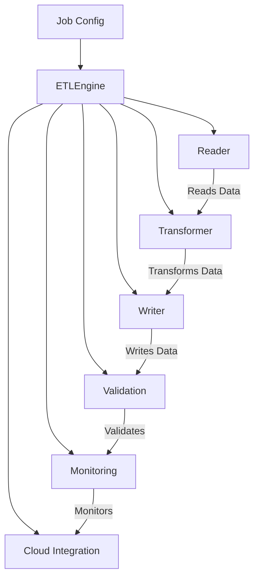

[](https://github.com/amitnema/spark-etl-framework/actions/workflows/maven.yml)
[](https://codecov.io/gh/amitnema/spark-etl-framework)
[](https://opensource.org/licenses/Apache-2.0)

# Spark ETL Framework

**Author:** Amit Prakash Nema

A generic, multimodule framework for building scalable ETL (Extract, Transform, Load) processes using Apache Spark and
Java. This framework is designed to be cloud-agnostic, maintainable, testable, and production-ready.

## Architecture Overview

The framework follows enterprise design patterns and consists of the following modules:

- **etl-core**: Core framework components including configuration, validation, transformation interfaces, and I/O
  operations
- **etl-jobs**: Concrete job implementations and custom transformers

## Architecture Diagram



## Key Features

- ✅ **Cloud Agnostic**: Supports AWS S3, Google Cloud Storage, Azure Blob Storage
- ✅ **Modular Design**: Separation of concerns with pluggable components
- ✅ **Configuration-Driven**: YAML-based job configuration with parameter substitution
- ✅ **Data Validation**: Built-in validation rules (NOT_NULL, UNIQUE, RANGE, REGEX)
- ✅ **Multiple Data Sources**: File systems, databases (JDBC), streaming sources
- ✅ **Format Support**: Parquet, JSON, CSV, Avro, ORC
- ✅ **Transformation Framework**: Abstract transformer pattern with custom implementations
- ✅ **Error Handling**: Comprehensive exception handling and logging
- ✅ **Production Ready**: Docker containerization, monitoring, and deployment scripts
- ✅ **Testing Support**: Unit and integration testing capabilities

## Project Structure

```
spark-etl-framework/
├── etl-core/                    # Core framework module
│   └── src/main/java/com/etl/core/
│       ├── config/              # Configuration management
│       ├── model/               # Data models and POJOs
│       ├── io/                  # Data readers and writers
│       ├── validation/          # Data validation components
│       ├── transformation/      # Transformation interfaces
│       ├── factory/             # Factory pattern implementations
│       ├── exception/           # Custom exceptions
│       └── utils/               # Utility classes
├── etl-jobs/                    # Job implementations
│   └── src/main/java/com/etl/jobs/
│       └── sample/              # Sample job implementation
├── dist/                        # Distribution packages
│   └── sample-job/              # Ready-to-deploy job package
├── docker/                      # Docker configuration
├── scripts/                     # Build and deployment scripts
└── README.md                    # This file
```

## Design Patterns Used

1. **Factory Pattern**: For creating readers, writers, and transformers
2. **Abstract Template Pattern**: For transformation pipeline
3. **Strategy Pattern**: For different I/O implementations
4. **Builder Pattern**: For configuration objects
5. **Singleton Pattern**: For configuration management
6. **Command Pattern**: For job execution

## Getting Started

### Prerequisites

- Java 11 (or higher)
- Maven 3.6+
- Docker (for containerized deployment)

### Build & Test

```sh
mvn clean verify
```

This runs all unit/integration tests, code quality checks, coverage, and security scans.

### Configuration

All configuration values can be overridden via environment variables. Example:

```sh
export DATABASE_URL="jdbc:postgresql://prod-db:5432/etl_db"
export AWS_ACCESS_KEY="your-access-key"
export AWS_SECRET_KEY="your-secret-key"
```

See `src/main/resources/application.properties` and `etl-jobs/src/main/resources/jobs/sample-job/job-config.yaml` for
all available variables.

### Running Locally

```sh
java -jar etl-jobs/target/etl-jobs-*.jar
```

### Running with Docker

Build and run the container:

```sh
docker build -t etl-framework:latest -f docker/Dockerfile .
docker run --rm -e DATABASE_URL="jdbc:postgresql://prod-db:5432/etl_db" etl-framework:latest
```

### CI/CD Workflows

- **Build, Test, Quality, Security**: See `.github/workflows/maven.yml`
- **Docker Build & Publish**: See `.github/workflows/docker.yml`

### Cloud Agnostic Deployment

- Supports AWS, GCP, Azure, and local deployments via environment variables.
- Containerized for Kubernetes, Docker Compose, or serverless platforms.

## Development Guide

### Creating Custom Transformers

Extend the `AbstractDataTransformer` class:

```java
public class MyCustomTransformer extends AbstractDataTransformer {
    @Override
    protected Dataset<Row> doTransform(Dataset<Row> input, Map<String, Object> parameters) {
        // Your transformation logic here
        return input.filter(functions.col("status").equalTo("active"));
    }
}
```

### Adding New Data Sources

Implement the `DataReader` interface:

```java
public class MyCustomReader implements DataReader {
    @Override
    public Dataset<Row> read(InputConfig config) {
        // Your data reading logic here
        return dataset;
    }
}
```

### Configuration Management

The framework uses a hierarchical configuration approach:

1. `application.properties` - Application-wide settings
2. `job-config.yaml` - Job-specific configuration
3. Command-line parameters - Runtime overrides

## Cloud Deployment

### AWS Configuration

```properties
cloud.provider=aws
aws.access.key=YOUR_ACCESS_KEY
aws.secret.key=YOUR_SECRET_KEY
aws.region=us-east-1
```

### GCP Configuration

```properties
cloud.provider=gcp
gcp.project.id=your-project-id
gcp.service.account.key=/path/to/service-account.json
```

### Azure Configuration

```properties
cloud.provider=azure
azure.storage.account=your-storage-account
azure.storage.access.key=your-access-key
```

## Docker Deployment

```bash
# Build Docker image
cd docker/
docker-compose build

# Run with Docker Compose
docker-compose up -d

# Execute ETL job in container
docker-compose exec etl-framework ./sample-job/spark-submit.sh
```

## Monitoring and Logging

The framework includes comprehensive logging using Logback:

- **Console Output**: Real-time job progress
- **File Logging**: Detailed logs with rotation
- **Structured Logging**: JSON format for log aggregation
- **Metrics**: Job execution metrics and validation results

## Testing

```bash
# Run unit tests
mvn test

# Run integration tests
mvn verify -P integration-tests
```

## Performance Tuning

### Spark Configuration

Key configuration parameters in `application.properties`:

```properties
spark.sql.adaptive.enabled=true
spark.sql.adaptive.coalescePartitions.enabled=true
spark.sql.adaptive.skewJoin.enabled=true
spark.serializer=org.apache.spark.serializer.KryoSerializer
```

### Memory Settings

Adjust memory settings in spark-submit script:

```bash
--driver-memory 4g
--executor-memory 8g
--executor-cores 4
```

## Contributing

- Fork the repo and create a feature branch.
- Run `mvn clean verify` before submitting a PR.
- Ensure new code is covered by tests and passes code quality checks.

## License

Apache 2.0

## Contact

For questions or support, open an issue or contact the maintainer

## Roadmap

- [ ] Kafka streaming support
- [ ] Delta Lake integration
- [ ] Advanced data profiling
- [ ] ML pipeline integration
- [ ] REST API for job management
- [ ] Web UI for monitoring

---

Built with ❤️ using Apache Spark and Java
